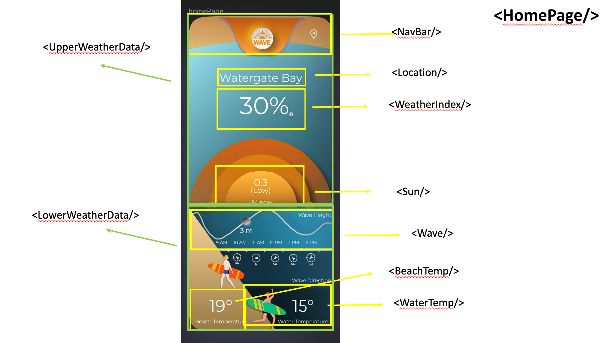

# Setup the first time
#### install "node" on your laptop (on Mac use "brew install node" and watch the instructions)
#### Clone the project
#### Open a terminal and run "npm install"

# Running Dev server
open a terminal window in your Visual Code IDE and execute the command:
npm run start

(and open a browser http://localhost:3000)

# Stop the Dev server
in the terminal window press the key combination:
control-c

# Home page components

.
